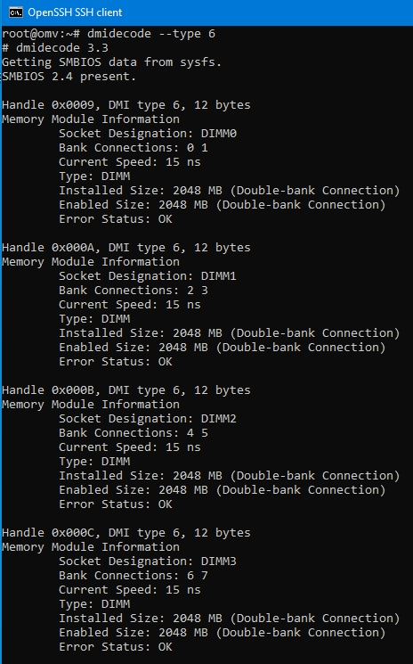
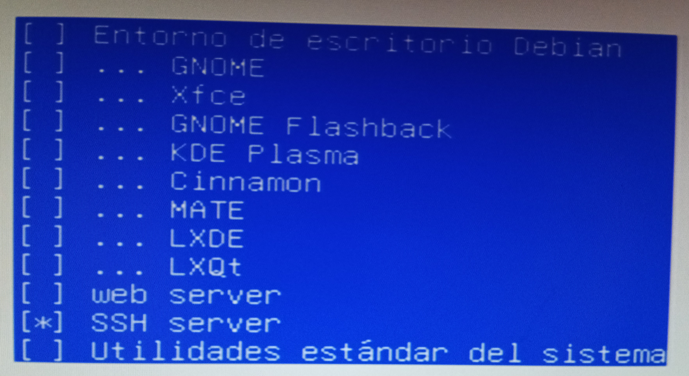
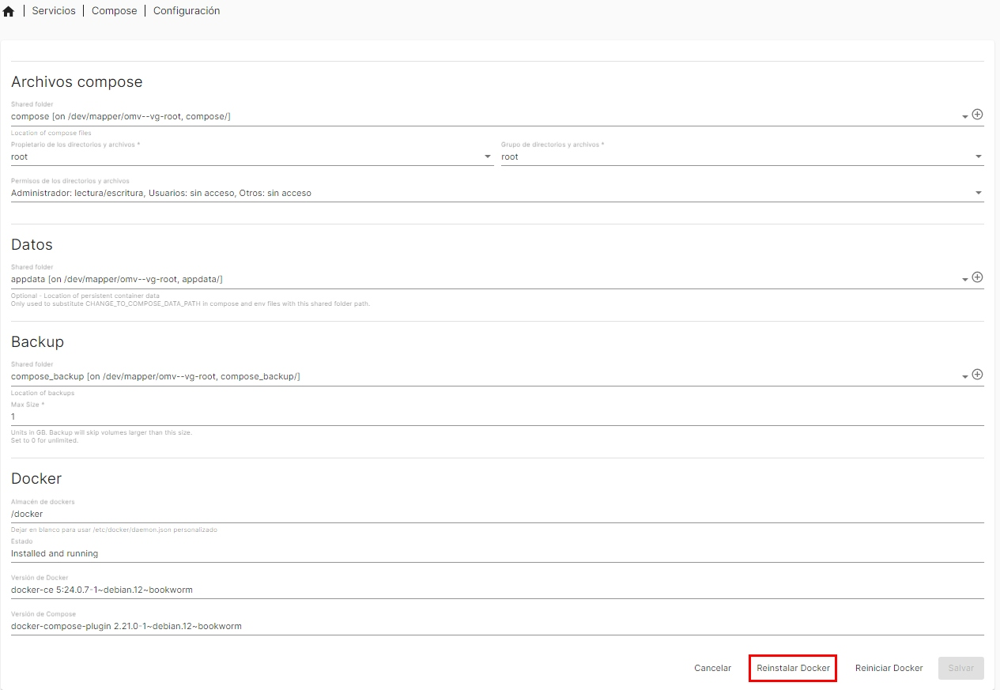
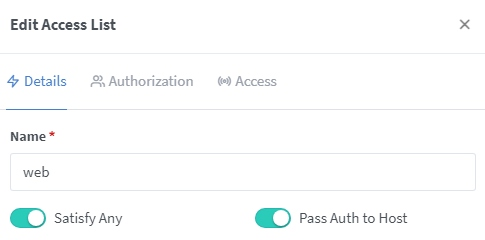
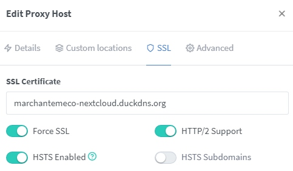

# OpenMediaVault, mucho más que un servidor NAS  
***  
```


```
  
```


```
Alumno: Jesús Marchante Meco  
Ciclo: Administración de Sistemas Operativos y Redes  
IES La Senia. Curso 2022/2024  
18 de Junio de 2024  
Tutor individual: Ángel Berlanas  

```


```
**Índice**   
1. [Introducción, justificación y objetivos](#id1) . . . . . . . . . . . pag. 3
2. [Planificación del proyecto](#id2) . . . . . . . . . . . . . . . . . . . . . pag. 4
3. [Recopilación de hardware](#id3) . . . . . . . . . . . . . . . . . . . . . pag. 5
4. [Instalación Debian 11 LVM](#id4) . . . . . . . . . . . . . . . . . . . . pag. 8
5. [Instalación OpenMediaVault 6](#id5) . . . . . . . . . . . . . . . . . pag. 10
6. [Instalación plugin lvm2](#id6) . . . . . . . . . . . . . . . . . . . . . . . pag. 11
7. [Añadir nuevo disco](#id7) . . . . . . . . . . . . . . . . . . . . . . . . . . . pag. 12
8. [Instalación plugin sharerootfs](#id8) . . . . . . . . . . . . . . . . . . pag. 15
9. [Instalación docker y docker-compose](#id9) . . . . . . . . . . . pag. 16
10. [Instalación nginx-proxy-manager](#id10) . . . . . . . . . . . . . . . pag. 19
11. [Sitio web](#id11) . . . . . . . . . . . . . . . . . . . . . . . . . . . . . . . . . . . . . pag. 21
12. [Nube privada NextCloud](#id12) . . . . . . . . . . . . . . . . . . . . . . . pag. 27
13. [Servidor multimedia Jellyfin](#id13) . . . . . . . . . . . . . . . . . . . . pag. 30
14. [Pruebas de seguridad](#id14) . . . . . . . . . . . . . . . . . . . . . . . . . pag. 33
15. [VPN](#id15) . . . . . . . . . . . . . . . . . . . . . . . . . . . . . . . . . . . . . . . . . pag. 43
16. [Conclusiones y ampliación](#id16) . . . . . . . . . . . . . . . . . . . . . pag. 47
17. [Referencias](#id17) . . . . . . . . . . . . . . . . . . . . . . . . . . . . . . . . . . . pag. 48
```


```
## Introducción, justificación y objetivos<a name="id1"></a>
Si eres una PYME/autónomo  que acabas de iniciar tu actividad, o incluso un particular, es seguro que necesitarás visibilidad en internet mediante tu sitio web, una nube privada sin restricciones no te vendrá mal, y seguro que le puedes sacar partido a un servidor de archivos multimedia.  
Todo esto se podría implemenar en empresas externas como [Amazon Web Services](https://aws.amazon.com/es/ec2/) o [Microsoft Azure](https://azure.microsoft.com/es-es), pero dado que no son gratuitas y no tenemos por qué creernos que ganantizan nuestra privacidad, decidimos montarlo en un equipo propio con la conexión a internet de nuestro domicilio.  
Tal y como se indica en la portada, si buscamos información acerca de OpenMediaVault encontraremos que es la nueva generación [NAS](https://es.wikipedia.org/wiki/Almacenamiento_conectado_en_red) basada en Debian; pero si rascamos un poco más nos daremos cuenta que nos va a permitir llevar a cabo todo lo anterior de una forma relativamente sencilla.  
Para este proyecto se implementará mediante OpenMediaVault 6 el sitio web de películas [marchantemeco.duckdns.org](marchantemeco.duckdns.org) (con su CRUD y su base de datos), la nube privada NextCloud [marchantemeco-nextcloud.duckdns.org](marchantemeco-nextcloud.duckdns.org) y el servidor multimedia Jellyfin [marchantemeco-jellyfin.duckdns.org](marchantemeco-jellyfin.duckdns.org), todo mediante certificados SSL autorenovables, accesibles a través de internet desde cualquier parte, y **abriendo sólo 2 puertos en el router** gracias al proxy inverso Nginx Proxy Manager.  
Como extra y para poder acceder desde cualquier parte a nuestra red local como un equipo más, se pondrá en marcha el servidor VPN más rápido, Wireguard, saliendo a internet a través de nuestra red (especialmente útil ya que Consellería bloquea los subdominios de duckdns), que además se integrará con PiHole (servidor DNS que resuelve dominios y subdominios asociados a ads a 0.0.0.0) para bloquear la publicidad, a costa de abrir un puerto más en el router.  
En un mundo hiperconectado, tener en cuenta la seguridad es a día de hoy una obligación, y más si estamos exponiendo a internet ciertos servicios abriendo puertos en el router, por lo que se realizarán ciertas pruebas de seguridad.  
```


```
## Planificación del proyecto<a name="id2"></a>
Diagrama de Gantt para mostrar cual ha sido el desarrollo del proceso, así cómo el tiempo destinado a cada parte:  
  
```


```
## Recopilación de hardware<a name="id3"></a>
Preciosa placa base [Asus P5K3 Deluxe/WiFi-AP LGA 775](https://encrypted-tbn0.gstatic.com/images?q=tbn:ANd9GcRWflyKW6i3HccjIgUh1OWiE24_tkGDnwTlvQ&usqp=CAU) modificada para reconocer la CPU de servidor [Intel Xeon X5460](https://www.intel.la/content/www/xl/es/products/sku/33087/intel-xeon-processor-x5460-12m-cache-3-16-ghz-1333-mhz-fsb/specifications.html)  (si nos fijamos se le ha aplicado un ligero overclock para alcanzar los 3.8GHz)  
  
4x2Gb de memoria RAM DDR3  
  
Tarjeta gráfica dedicada AMD HD5850  
  
2 discos mecánicos IDE  
  
```


```
## Instalación Debian 11 LVM<a name="id4"></a>
Instalamos Debian 11 a partir de la [iso netinst para PC de 64 bits](https://cdimage.debian.org/cdimage/archive/11.9.0/amd64/iso-cd/debian-11.9.0-amd64-netinst.iso)  
- Llegados al particionado se elige LVM  

- Elegimos el disco a particionar

- Todo en la partición raiz /

- Creará los volúmenes lógicos **root** (para el sistema de archivos /) y **swap_1** (para el área de intercambio) y los meterá en el grupo de volúmenes **omv-vg**

- No debemos instalar entorno gráfico, sólo el servidor SSH, ésto es importante  

```


```
## Instalación de OpenMediaVault 6<a name="id5"></a>
- Nos conectamos mediante SSH al servidor (la dirección IP 192.168.1.11 es dinámica pero está reservada en el servidor DHCP) y lanzamos como superusuario según la [guía](https://github.com/OpenMediaVault-Plugin-Developers/installScript) ```wget -O - https://github.com/OpenMediaVault-Plugin-Developers/installScript/raw/master/install | bash``` para instalar OpenMediaVault junto con los plugins OMV-Extras y Flashmemory

- Si todo ha ido bien nos mostrará un bonito Done  

```


```
## Instalación plugin lvm2<a name="id6"></a>
Nos permitirá añadir nuevos discos al volumen lógico sin tirar un sólo comando:  
- Introducimos en el navegador web la dirección ip del servidor; por defecto el usuario es **admin** y la contraseña es **openmediavault**  

- Instalamos este plugin  

## Añadir nuevo disco<a name="id7"></a>
Añadimos un nuevo disco al equipo y extendemos el volumen lógico  
- Ya que es un disco usado, primero vamos a borrarle la tabla de particiones  

- Creamos un volumen físico  


- Extendemos el grupo de volúmenes con el nuevo volumen físico  


- Extendemos el volumen lógico /dev/omv-vg/root al 100% del espacio  

  
Una maravilla, con el nuevo disco hemos pasado de tener casi 300GB de almacenamiento a más de 500GB (varios volúmenes físicos como un único volumen lógico).  
  
Resumen del sistema:  

```


```
## Instalación plugin sharerootfs<a name="id8"></a>
Necesitamos instalar el siguiente plugin para que OpenMediaVault pueda trabajar con el sistema de archivos raiz:  

Una vez instalado ya nos aparece en Sistema de Archivos, si no **no aparecerá**  
  
```


```
## Instalación docker y docker-compose<a name="id9"></a>
Quizás se me haya pasado, pero aquí todo funciona mediante contenedores, por lo que hemos de hacer los siguientes paso:  
- Primero activamos el check "Docker repo" y pulsamos en "Salvar"  
  
- Después instalamos el siguiente plugin  
  
- Compartimos las carpetas appdata, compose, compose_backup, docker y configuramos docker-compose con ellas  


- Si todo ha ido bien, reinstalamos docker con la nueva configuración  

```


```
## Instalación nginx-proxy-manager<a name="id10"></a>
Este proxy inverso es la aplicación que nos va a permitir tener cuantas aplicaciones deseemos, cada una trabajando en un puerto diferente, pero accediendo a ellas desde internet sin tener abiertos en el router todos esos puertos, sino sólo los puertos 80 y 433.  
Además nos permitirá disponer de certificados SSL para cada una de esas aplicaciones y que éstos se renueven automáticamente, atentificación Digest, etc.  
Dicha aplicación también la podemos instalar fácilmente desde los ejemplos (recomiendo la versión 2.9.19)  
  
Como nos explican en la documentación, los puertos 80 y 443 han de ser públicos (NAT en el router), y el puerto 81 es que utilizaremos para administrar la aplicación localmente  
  
Cuando ingresemos por primera vez el usuario es admin@example.com y la contraseña es changeme, los cuales después deberíamos cambiar  
  
Prácticamente no tenemos que configurar casi nada, salvo la zona horaria, la ruta a los volúmenes  
  
Ahora crearemos un certificado SSL/Proxy Host para cada uno de nuestros dominios/aplicaciones  
```


```
## Sitio web<a name="id11"></a>
Creo el sitio web [marchantemeco.duckdns.org](http://marchantemeco.duckdns.org) con la siguiente configuración (escucha en el puerto **8080**)  
```
version: "3.1"
services:
    db:
        image: mysql
        ports: 
            - "8306:3306"
        command: --default-authentication-plugin=mysql_native_password
        environment:
            MYSQL_DATABASE: peliculastmdb
            MYSQL_PASSWORD: test
            MYSQL_ROOT_PASSWORD: test
        volumes:
            - /appdata/dump:/docker-entrypoint-initdb.d
            - /appdata/conf:/etc/mysql/conf.d
            - /appdata/persistent:/var/lib/mysql
        networks:
            - default
        restart: unless-stopped
    www:
        image: php:8.0.0-apache
        ports: 
            - "8080:80"
        volumes:
            - /appdata/www:/var/www/html
        links:
            - db
        environment:
            - DEBIAN_FRONTEND=noninteractive
        command: >
            bash -c "apt update && apt install -y sendmail libpng-dev libzip-dev zlib1g-dev libonig-dev && apt install -y nodejs && docker-php-ext-install mysqli pdo pdo_mysql && a2enmod rewrite && apache2-foreground"
        networks:
            - default
        restart: unless-stopped
    phpmyadmin:
        image: phpmyadmin/phpmyadmin
        links: 
            - db:db
        ports:
            - 8000:80
        environment:
            MYSQL_USER: root
            MYSQL_PASSWORD: test
            MYSQL_ROOT_PASSWORD: test
        restart: unless-stopped
volumes:
    persistent:
```
Como no queremos que nadie no autorizado pueda crear nuevas películas, creamos una lista  de control de acceso  
  
  
Y ya por último indicamos al proxy que toda petición a nuestro dominio se redirija a nuestra dirección IP local y puerto **8080**, asignando la lista de control de acceso anteriormente creada y el certificado SSL  
  
  
Y dado que ni el proyecto web ni la base de datos apuntan a localhost, y tenemos un proxy de por medio ¿se habrán tenido que modificar ciertos archivos? Por supuesto, los siguientes, y saber cuales son puede requerir muuuucho tiempo:  
- /config/livewire.php
    ```
    'asset_url' => 'https://marchantemeco.duckdns.org/public',
    ```
- /.env
    ```
    APP_URL=https://marchantemeco.duckdns.org
    DB_HOST=db
    DB_PASSWORD=test
    ```
- /resources/js/insertar_con_api.js
    ```
    "host"     : "db",
    "password" : "test",
    ```
- /app/Http/Middleware/TrustProxies.php
    ```
    protected $proxies = '*';
    ```
Entrando en el sitio web con autentificación Digest  
  
Sitio web seguro mediante certificado SSL firmado por Let's Encrypt  
  
No podía faltar un CRUD con su paginación para buscar películas en la base de datos, aunque ya veremos en la defensa que la página es capaz de hacer muchas más cositas  
  
```


```
## Nube privada NextCloud<a name="id12"></a> 
NextCloud también está disponible desde los ejemplos, lo cual es subifiente para un ámbito doméstico (si nuestras necesidades son más serias instalaríamos la versión oficial copiando la configuración "Base version - apache" de la página de [github](https://github.com/nextcloud/docker))  
  
Tampoco tenemos que configurar mucho, sólo la zona horaria y la ruta a los volúmenes (escucha en el puerto **8443**)  
  
Al igual que hicimos con el sitio web, indicamos al proxy que toda petición a nuestro dominio se redirija a nuestra dirección IP local y puerto **8443**, asignando el certificado SSL  
  
  
**Puede** que cuando accedamos con nuestro nombre de dominio nos apareciera un cartelito informándonos que no se confía en él y que editemos la configuración "trusted_domains" en config/config.php.  
  
Para ello editaremos el archivo /appdata/nextcloud/config/www/nextcloud/config/config.php y añadimos al array trusted_domains nuestro dominio marchantemeco-nextcloud.duckdns.org  
  
Conexión segura a [marchantemeco-nextcloud.duckdns.org](http://marchantemeco-nextcloud.duckdns.org) mediante certificado SSL firmado por Let's Encrypt   
  
```
```
## Servidor multimedia Jellyfin<a name="id13"></a> 
Jellyfin también está disponible desde los ejemplos  
  
Tampoco tenemos que configurar mucho, sólo la zona horaria y la ruta a los volúmenes (escucha en el puerto **8096**)  
  
Indicamos al proxy que toda petición a nuestro dominio se redirija a nuestra dirección IP local y puerto **8096**, asignando el certificado SSL  
  
  
Conexión segura a [marchantemeco-jellyfin.duckdns.org](http://marchantemeco-jellyfin.duckdns.org) mediante certificado SSL firmado por Let's Encrypt   
  
```


```
## Pruebas de seguridad<a name="id14"></a> 
Vemos que a los dominios marchantemeco.duckdns.org, marchantemeco-nextcloud.duckdns.org y marchantemeco-jellyfin.duckdns.org responde nuestra dirección IP pública 188.79.149.152, la cual si introdujésemos en el navegador web y por seguridad, nos redirigiría a https://google.es  
  
- Primero vamos a escanear la dirección IP pública:  
```
sudo nmap -v -A 188.79.149.152
Starting Nmap 7.80 ( https://nmap.org ) at 2024-04-02 14:07 CEST
NSE: Loaded 151 scripts for scanning.
NSE: Script Pre-scanning.
Initiating NSE at 14:07
Completed NSE at 14:07, 0.00s elapsed
Initiating NSE at 14:07
Completed NSE at 14:07, 0.00s elapsed
Initiating NSE at 14:07
Completed NSE at 14:07, 0.00s elapsed
Initiating Ping Scan at 14:07
Scanning 188.79.149.152 [2 ports]
Completed Ping Scan at 14:07, 0.00s elapsed (1 total hosts)
Initiating Parallel DNS resolution of 1 host. at 14:07
Completed Parallel DNS resolution of 1 host. at 14:07, 0.00s elapsed
Initiating Connect Scan at 14:07
Scanning 152.149.79.188.dynamic.jazztel.es (188.79.149.152) [1000 ports]
Discovered open port 80/tcp on 188.79.149.152
Discovered open port 443/tcp on 188.79.149.152
Completed Connect Scan at 14:07, 4.05s elapsed (1000 total ports)
Initiating Service scan at 14:07
Scanning 2 services on 152.149.79.188.dynamic.jazztel.es (188.79.149.152)
Completed Service scan at 14:07, 17.41s elapsed (2 services on 1 host)
NSE: Script scanning 188.79.149.152.
Initiating NSE at 14:07
Completed NSE at 14:07, 0.54s elapsed
Initiating NSE at 14:07
Completed NSE at 14:07, 0.19s elapsed
Initiating NSE at 14:07
Completed NSE at 14:07, 0.00s elapsed
Nmap scan report for 152.149.79.188.dynamic.jazztel.es (188.79.149.152)
Host is up (0.0077s latency).
Not shown: 998 filtered ports
PORT    STATE SERVICE  VERSION
80/tcp  open  http     OpenResty web app server
| http-methods: 
|_  Supported Methods: GET HEAD POST OPTIONS
|_http-server-header: openresty
|_http-title: Did not follow redirect to https://google.es
443/tcp open  ssl/http OpenResty web app server
|_http-server-header: openresty
|_http-title: 400 The plain HTTP request was sent to HTTPS port
| ssl-cert: Subject: commonName=localhost/organizationName=localhost
| Issuer: commonName=localhost/organizationName=localhost
| Public Key type: rsa
| Public Key bits: 2048
| Signature Algorithm: sha256WithRSAEncryption
| Not valid before: 2024-03-15T11:17:22
| Not valid after:  2034-03-13T11:17:22
| MD5:   5f42 84de 6ef7 8aa2 1d29 49f4 2f19 26af
|_SHA-1: 236c 8839 99bd 76eb 9086 d7ea 5948 e2ce ac2e f76e

NSE: Script Post-scanning.
Initiating NSE at 14:07
Completed NSE at 14:07, 0.00s elapsed
Initiating NSE at 14:07
Completed NSE at 14:07, 0.00s elapsed
Initiating NSE at 14:07
Completed NSE at 14:07, 0.00s elapsed
Read data files from: /usr/bin/../share/nmap
Service detection performed. Please report any incorrect results at https://nmap.org/submit/ .
Nmap done: 1 IP address (1 host up) scanned in 23.38 seconds
```
```
sudo nmap -Pn -n -sV -O 188.79.149.152
Starting Nmap 7.80 ( https://nmap.org ) at 2024-04-02 14:15 CEST
Nmap scan report for 188.79.149.152
Host is up (0.0019s latency).
Not shown: 998 filtered ports
PORT    STATE SERVICE  VERSION
80/tcp  open  http     OpenResty web app server
443/tcp open  ssl/http OpenResty web app server
Warning: OSScan results may be unreliable because we could not find at least 1 open and 1 closed port
Device type: bridge|general purpose
Running (JUST GUESSING): Oracle Virtualbox (98%), QEMU (93%)
OS CPE: cpe:/o:oracle:virtualbox cpe:/a:qemu:qemu
Aggressive OS guesses: Oracle Virtualbox (98%), QEMU user mode network gateway (93%)
No exact OS matches for host (test conditions non-ideal).
```
No ha conseguido sacar la versión del servidor web ni el sistema operativo que lo aloja, sólo que por el puerto 80 redirige a https://google.es, y por el puerto 443 devuelve un error 400 Bad Request (o sea, no responde).  
Los hackers lo van a tener difícil.  
- Ahora vamos a escanear los servicios:  
    - marchantemeco.duckdns.org  
    ```
    sudo nmap -v -A marchantemeco.duckdns.org
    Starting Nmap 7.80 ( https://nmap.org ) at 2024-04-02 14:39 CEST
    NSE: Loaded 151 scripts for scanning.
    NSE: Script Pre-scanning.
    Initiating NSE at 14:39
    Completed NSE at 14:39, 0.00s elapsed
    Initiating NSE at 14:39
    Completed NSE at 14:39, 0.00s elapsed
    Initiating NSE at 14:39
    Completed NSE at 14:39, 0.00s elapsed
    Initiating Ping Scan at 14:39
    Scanning marchantemeco.duckdns.org (188.79.149.152) [4 ports]
    Completed Ping Scan at 14:39, 0.03s elapsed (1 total hosts)
    Initiating Parallel DNS resolution of 1 host. at 14:39
    Completed Parallel DNS resolution of 1 host. at 14:39, 0.00s elapsed
    Initiating SYN Stealth Scan at 14:39
    Scanning marchantemeco.duckdns.org (188.79.149.152) [1000 ports]
    Discovered open port 80/tcp on 188.79.149.152
    Discovered open port 443/tcp on 188.79.149.152
    Increasing send delay for 188.79.149.152 from 0 to 5 due to max_successful_tryno increase to 4
    Completed SYN Stealth Scan at 14:40, 51.81s elapsed (1000 total ports)
    Initiating Service scan at 14:40
    Scanning 2 services on marchantemeco.duckdns.org (188.79.149.152)
    Completed Service scan at 14:40, 17.31s elapsed (2 services on 1 host)
    Initiating OS detection (try #1) against marchantemeco.duckdns.org (188.79.149.152)
    Retrying OS detection (try #2) against marchantemeco.duckdns.org (188.79.149.152)
    Initiating Traceroute at 14:40
    Completed Traceroute at 14:40, 0.02s elapsed
    Initiating Parallel DNS resolution of 2 hosts. at 14:40
    Completed Parallel DNS resolution of 2 hosts. at 14:40, 0.10s elapsed
    NSE: Script scanning 188.79.149.152.
    Initiating NSE at 14:40
    Completed NSE at 14:40, 0.51s elapsed
    Initiating NSE at 14:40
    Completed NSE at 14:40, 0.15s elapsed
    Initiating NSE at 14:40
    Completed NSE at 14:40, 0.00s elapsed
    Nmap scan report for marchantemeco.duckdns.org (188.79.149.152)
    Host is up (0.0020s latency).
    rDNS record for 188.79.149.152: 152.149.79.188.dynamic.jazztel.es
    Not shown: 993 filtered ports
    PORT     STATE  SERVICE   VERSION
    80/tcp   open   http      OpenResty web app server
    | http-methods: 
    |_  Supported Methods: GET HEAD POST OPTIONS
    |_http-server-header: openresty
    |_http-title: Did not follow redirect to https://marchantemeco.duckdns.org/
    443/tcp  open   ssl/http  OpenResty web app server
    | http-auth: 
    | HTTP/1.1 401 Unauthorized\x0D
    |_  Basic realm=Authorization required
    |_http-server-header: openresty
    |_http-title: 401 Authorization Required
    | ssl-cert: Subject: commonName=marchantemeco.duckdns.org
    | Subject Alternative Name: DNS:marchantemeco.duckdns.org
    | Issuer: commonName=R3/organizationName=Let's Encrypt/countryName=US
    | Public Key type: ec
    | Public Key bits: 384
    | Signature Algorithm: sha256WithRSAEncryption
    | Not valid before: 2024-03-06T16:30:47
    | Not valid after:  2024-06-04T16:30:46
    | MD5:   f72b f7b9 fb9c be82 b5a2 89b2 4988 9d7c
    |_SHA-1: e7ff 765e 331c 594e b9d5 1f6d 6494 26cc 96c8 abfd
    2006/tcp closed invokator
    2007/tcp closed dectalk
    2323/tcp closed 3d-nfsd
    8000/tcp closed http-alt
    8443/tcp closed https-alt
    Device type: bridge|general purpose
    Running (JUST GUESSING): Oracle Virtualbox (97%), QEMU (93%)
    OS CPE: cpe:/o:oracle:virtualbox cpe:/a:qemu:qemu
    Aggressive OS guesses: Oracle Virtualbox (97%), QEMU user mode network gateway (93%)
    No exact OS matches for host (test conditions non-ideal).
    Network Distance: 2 hops
    TCP Sequence Prediction: Difficulty=17 (Good luck!)
    IP ID Sequence Generation: Incremental

    TRACEROUTE (using port 80/tcp)
    HOP RTT     ADDRESS
    1   0.40 ms _gateway (10.0.2.2)
    2   0.48 ms 152.149.79.188.dynamic.jazztel.es (188.79.149.152)

    NSE: Script Post-scanning.
    Initiating NSE at 14:40
    Completed NSE at 14:40, 0.00s elapsed
    Initiating NSE at 14:40
    Completed NSE at 14:40, 0.00s elapsed
    Initiating NSE at 14:40
    Completed NSE at 14:40, 0.00s elapsed
    Read data files from: /usr/bin/../share/nmap
    OS and Service detection performed. Please report any incorrect results at https://nmap.org/submit/ .
    Nmap done: 1 IP address (1 host up) scanned in 75.83 seconds
            Raw packets sent: 6066 (269.876KB) | Rcvd: 126 (5.612KB)
    ```
    ```
    sudo nmap -Pn -n -sV -O marchantemeco.duckdns.org
    Starting Nmap 7.80 ( https://nmap.org ) at 2024-04-02 14:43 CEST
    Nmap scan report for marchantemeco.duckdns.org (188.79.149.152)
    Host is up (0.0030s latency).
    Not shown: 998 filtered ports
    PORT    STATE SERVICE  VERSION
    80/tcp  open  http     OpenResty web app server
    443/tcp open  ssl/http OpenResty web app server
    Warning: OSScan results may be unreliable because we could not find at least 1 open and 1 closed port
    Device type: bridge|general purpose
    Running (JUST GUESSING): Oracle Virtualbox (98%), QEMU (93%)
    OS CPE: cpe:/o:oracle:virtualbox cpe:/a:qemu:qemu
    Aggressive OS guesses: Oracle Virtualbox (98%), QEMU user mode network gateway (93%)
    No exact OS matches for host (test conditions non-ideal).

    OS and Service detection performed. Please report any incorrect results at https://nmap.org/submit/ .
    Nmap done: 1 IP address (1 host up) scanned in 28.43 seconds
    ```
    - marchantemeco-nextcloud.org  
    ```
    sudo nmap -v -A marchantemeco-nextcloud.duckdns.org
    Starting Nmap 7.80 ( https://nmap.org ) at 2024-04-02 16:06 CEST
    NSE: Loaded 151 scripts for scanning.
    NSE: Script Pre-scanning.
    Initiating NSE at 16:06
    Completed NSE at 16:06, 0.00s elapsed
    Initiating NSE at 16:06
    Completed NSE at 16:06, 0.00s elapsed
    Initiating NSE at 16:06
    Completed NSE at 16:06, 0.00s elapsed
    Initiating Ping Scan at 16:06
    Scanning marchantemeco-nextcloud.duckdns.org (188.79.149.152) [4 ports]
    Completed Ping Scan at 16:06, 0.02s elapsed (1 total hosts)
    Initiating Parallel DNS resolution of 1 host. at 16:06
    Completed Parallel DNS resolution of 1 host. at 16:06, 0.01s elapsed
    Initiating SYN Stealth Scan at 16:06
    Scanning marchantemeco-nextcloud.duckdns.org (188.79.149.152) [1000 ports]
    Discovered open port 443/tcp on 188.79.149.152
    Discovered open port 80/tcp on 188.79.149.152
    Completed SYN Stealth Scan at 16:06, 5.00s elapsed (1000 total ports)
    Initiating Service scan at 16:06
    Scanning 2 services on marchantemeco-nextcloud.duckdns.org (188.79.149.152)
    Completed Service scan at 16:06, 17.45s elapsed (2 services on 1 host)
    Initiating OS detection (try #1) against marchantemeco-nextcloud.duckdns.org (188.79.149.152)
    Retrying OS detection (try #2) against marchantemeco-nextcloud.duckdns.org (188.79.149.152)
    Initiating Traceroute at 16:06
    Completed Traceroute at 16:06, 0.03s elapsed
    Initiating Parallel DNS resolution of 2 hosts. at 16:06
    Completed Parallel DNS resolution of 2 hosts. at 16:06, 0.01s elapsed
    NSE: Script scanning 188.79.149.152.
    Initiating NSE at 16:06
    Completed NSE at 16:06, 0.37s elapsed
    Initiating NSE at 16:06
    Completed NSE at 16:06, 0.15s elapsed
    Initiating NSE at 16:06
    Completed NSE at 16:06, 0.00s elapsed
    Nmap scan report for marchantemeco-nextcloud.duckdns.org (188.79.149.152)
    Host is up (0.00096s latency).
    rDNS record for 188.79.149.152: 152.149.79.188.dynamic.jazztel.es
    Not shown: 998 filtered ports
    PORT    STATE SERVICE  VERSION
    80/tcp  open  http     OpenResty web app server
    | http-methods: 
    |_  Supported Methods: GET HEAD POST OPTIONS
    |_http-server-header: openresty
    |_http-title: Did not follow redirect to https://marchantemeco-nextcloud.duckdns.org/
    443/tcp open  ssl/http OpenResty web app server
    |_http-server-header: openresty
    |_http-title: 502 Bad Gateway
    | ssl-cert: Subject: commonName=marchantemeco-nextcloud.duckdns.org
    | Subject Alternative Name: DNS:marchantemeco-nextcloud.duckdns.org
    | Issuer: commonName=R3/organizationName=Let's Encrypt/countryName=US
    | Public Key type: ec
    | Public Key bits: 384
    | Signature Algorithm: sha256WithRSAEncryption
    | Not valid before: 2024-03-06T16:39:54
    | Not valid after:  2024-06-04T16:39:53
    | MD5:   39d7 f017 90ec 678f d62b a9e3 8291 2897
    |_SHA-1: 022a 8d5e 0f3d 425f e878 185e 3551 80d7 643e 6b5a
    Warning: OSScan results may be unreliable because we could not find at least 1 open and 1 closed port
    Device type: bridge|general purpose
    Running (JUST GUESSING): Oracle Virtualbox (98%), QEMU (93%)
    OS CPE: cpe:/o:oracle:virtualbox cpe:/a:qemu:qemu
    Aggressive OS guesses: Oracle Virtualbox (98%), QEMU user mode network gateway (93%)
    No exact OS matches for host (test conditions non-ideal).
    Network Distance: 2 hops
    TCP Sequence Prediction: Difficulty=17 (Good luck!)
    IP ID Sequence Generation: Incremental

    TRACEROUTE (using port 80/tcp)
    HOP RTT     ADDRESS
    1   0.58 ms _gateway (10.0.2.2)
    2   0.48 ms 152.149.79.188.dynamic.jazztel.es (188.79.149.152)

    NSE: Script Post-scanning.
    Initiating NSE at 16:06
    Completed NSE at 16:06, 0.00s elapsed
    Initiating NSE at 16:06
    Completed NSE at 16:06, 0.00s elapsed
    Initiating NSE at 16:06
    Completed NSE at 16:06, 0.00s elapsed
    Read data files from: /usr/bin/../share/nmap
    OS and Service detection performed. Please report any incorrect results at https://nmap.org/submit/ .
    Nmap done: 1 IP address (1 host up) scanned in 28.92 seconds
    ```
    ```
    sudo nmap -Pn -n -sV -O marchantemeco-nextcloud.duckdns.org
    Starting Nmap 7.80 ( https://nmap.org ) at 2024-04-02 16:09 CEST
    Nmap scan report for marchantemeco-nextcloud.duckdns.org (188.79.149.152)
    Host is up (0.0015s latency).
    Not shown: 998 filtered ports
    PORT    STATE SERVICE  VERSION
    80/tcp  open  http     OpenResty web app server
    443/tcp open  ssl/http OpenResty web app server
    Warning: OSScan results may be unreliable because we could not find at least 1 open and 1 closed port
    Device type: bridge|general purpose
    Running (JUST GUESSING): Oracle Virtualbox (98%), QEMU (93%)
    OS CPE: cpe:/o:oracle:virtualbox cpe:/a:qemu:qemu
    Aggressive OS guesses: Oracle Virtualbox (98%), QEMU user mode network gateway (93%)
    No exact OS matches for host (test conditions non-ideal).

    OS and Service detection performed. Please report any incorrect results at https://nmap.org/submit/ .
    Nmap done: 1 IP address (1 host up) scanned in 28.46 seconds
    ```
    - marchantemeco-jellyfin.org  
    ```
    sudo nmap -v -A marchantemeco-jellyfin.duckdns.org
    Starting Nmap 7.80 ( https://nmap.org ) at 2024-04-02 16:11 CEST
    NSE: Loaded 151 scripts for scanning.
    NSE: Script Pre-scanning.
    Initiating NSE at 16:11
    Completed NSE at 16:11, 0.00s elapsed
    Initiating NSE at 16:11
    Completed NSE at 16:11, 0.00s elapsed
    Initiating NSE at 16:11
    Completed NSE at 16:11, 0.00s elapsed
    Initiating Ping Scan at 16:11
    Scanning marchantemeco-jellyfin.duckdns.org (188.79.149.152) [4 ports]
    Completed Ping Scan at 16:11, 0.02s elapsed (1 total hosts)
    Initiating Parallel DNS resolution of 1 host. at 16:11
    Completed Parallel DNS resolution of 1 host. at 16:11, 0.00s elapsed
    Initiating SYN Stealth Scan at 16:11
    Scanning marchantemeco-jellyfin.duckdns.org (188.79.149.152) [1000 ports]
    Discovered open port 80/tcp on 188.79.149.152
    Discovered open port 443/tcp on 188.79.149.152
    Completed SYN Stealth Scan at 16:11, 5.15s elapsed (1000 total ports)
    Initiating Service scan at 16:11
    Scanning 2 services on marchantemeco-jellyfin.duckdns.org (188.79.149.152)
    Completed Service scan at 16:11, 17.41s elapsed (2 services on 1 host)
    Initiating OS detection (try #1) against marchantemeco-jellyfin.duckdns.org (188.79.149.152)
    Retrying OS detection (try #2) against marchantemeco-jellyfin.duckdns.org (188.79.149.152)
    Initiating Traceroute at 16:11
    Completed Traceroute at 16:11, 0.03s elapsed
    Initiating Parallel DNS resolution of 2 hosts. at 16:11
    Completed Parallel DNS resolution of 2 hosts. at 16:11, 0.00s elapsed
    NSE: Script scanning 188.79.149.152.
    Initiating NSE at 16:11
    Completed NSE at 16:11, 0.50s elapsed
    Initiating NSE at 16:11
    Completed NSE at 16:11, 0.16s elapsed
    Initiating NSE at 16:11
    Completed NSE at 16:11, 0.00s elapsed
    Nmap scan report for marchantemeco-jellyfin.duckdns.org (188.79.149.152)
    Host is up (0.00066s latency).
    rDNS record for 188.79.149.152: 152.149.79.188.dynamic.jazztel.es
    Not shown: 998 filtered ports
    PORT    STATE SERVICE  VERSION
    80/tcp  open  http     OpenResty web app server
    | http-methods: 
    |_  Supported Methods: GET HEAD POST OPTIONS
    |_http-server-header: openresty
    |_http-title: Did not follow redirect to https://marchantemeco-jellyfin.duckdns.org/
    443/tcp open  ssl/http OpenResty web app server
    | http-methods: 
    |_  Supported Methods: GET HEAD POST OPTIONS
    | http-robots.txt: 1 disallowed entry 
    |_/
    |_http-server-header: openresty
    | http-title: Jellyfin
    |_Requested resource was /web/index.html
    | ssl-cert: Subject: commonName=marchantemeco-jellyfin.duckdns.org
    | Subject Alternative Name: DNS:marchantemeco-jellyfin.duckdns.org
    | Issuer: commonName=R3/organizationName=Let's Encrypt/countryName=US
    | Public Key type: ec
    | Public Key bits: 384
    | Signature Algorithm: sha256WithRSAEncryption
    | Not valid before: 2024-04-01T17:51:00
    | Not valid after:  2024-06-30T17:50:59
    | MD5:   7872 8072 2724 f947 50ab c690 0845 838e
    |_SHA-1: 6e1b d2d7 c8ff 6f3b f8f1 57b8 cf9e d0e3 3b2a 5138
    Warning: OSScan results may be unreliable because we could not find at least 1 open and 1 closed port
    Device type: bridge|general purpose
    Running (JUST GUESSING): Oracle Virtualbox (98%), QEMU (93%)
    OS CPE: cpe:/o:oracle:virtualbox cpe:/a:qemu:qemu
    Aggressive OS guesses: Oracle Virtualbox (98%), QEMU user mode network gateway (93%)
    No exact OS matches for host (test conditions non-ideal).
    Network Distance: 2 hops
    TCP Sequence Prediction: Difficulty=17 (Good luck!)
    IP ID Sequence Generation: Incremental

    TRACEROUTE (using port 80/tcp)
    HOP RTT     ADDRESS
    1   0.30 ms _gateway (10.0.2.2)
    2   0.37 ms 152.149.79.188.dynamic.jazztel.es (188.79.149.152)

    NSE: Script Post-scanning.
    Initiating NSE at 16:11
    Completed NSE at 16:11, 0.00s elapsed
    Initiating NSE at 16:11
    Completed NSE at 16:11, 0.00s elapsed
    Initiating NSE at 16:11
    Completed NSE at 16:11, 0.00s elapsed
    Read data files from: /usr/bin/../share/nmap
    OS and Service detection performed. Please report any incorrect results at https://nmap.org/submit/ .
    Nmap done: 1 IP address (1 host up) scanned in 29.28 seconds
            Raw packets sent: 2059 (93.748KB) | Rcvd: 58 (2.892KB)
    ```
    ```
    sudo nmap -Pn -n -sV -O marchantemeco-jellyfin.duckdns.org
    Starting Nmap 7.80 ( https://nmap.org ) at 2024-04-02 16:16 CEST
    Nmap scan report for marchantemeco-jellyfin.duckdns.org (188.79.149.152)
    Host is up (0.0015s latency).
    Not shown: 998 filtered ports
    PORT    STATE SERVICE  VERSION
    80/tcp  open  http     OpenResty web app server
    443/tcp open  ssl/http OpenResty web app server
    Warning: OSScan results may be unreliable because we could not find at least 1 open and 1 closed port
    Device type: bridge|general purpose
    Running (JUST GUESSING): Oracle Virtualbox (98%), QEMU (93%)
    OS CPE: cpe:/o:oracle:virtualbox cpe:/a:qemu:qemu
    Aggressive OS guesses: Oracle Virtualbox (98%), QEMU user mode network gateway (93%)
    No exact OS matches for host (test conditions non-ideal).

    OS and Service detection performed. Please report any incorrect results at https://nmap.org/submit/ .
    Nmap done: 1 IP address (1 host up) scanned in 28.72 seconds
    ```
    Por el puerto 80 redirigen a la conexión segura https, y por el puerto 443 tenemos la conexión segura mediante certificado SSL firmado por Let's Encrypt.  
    Sigue sin conseguir sacar la versión del servidor web ni el sistema operativo que lo aloja, por lo que va a ser difícil que un hacker sepa por dónde meterle mano.  
```


```
## VPN<a name="id15"></a>  
Para probar la VPN conectaremos el cliente a internet (sería absurdo hacerlo a través de nuestro propio router, por lo que lo haremos a través de una red WIFI pública), y activaremos la conexión VPN Wireguard para poder ser un equipo más de nuestra red local (192.168.1.0/24).   
La publicidad será bloqueada mediante PiHole, por lo que si además configuramos los equipos de nuestra red local como servidor DNS al equipo OpenMediaVault (192.168.1.11) estaremos bloqueando la publicidad para todos ellos de manera fácil y transparente.  
- Wireguard + PiHole:  
    ```
    version: "3.8"
    services:
    wg-easy:
        environment:
        - LANG=es
        # Change this to your host's public address
        - WG_HOST=marchantemeco.duckdns.org
        # Web UI Password:
        - PASSWORD=test
        - WG_DEFAULT_ADDRESS=10.8.0.x
        - WG_DEFAULT_DNS=10.8.1.3
        - WG_PERSISTENT_KEEPALIVE=25
        # - WG_MTU=1420
        - WG_ALLOWED_IPS=192.168.1.0/24, 0.0.0.0/1, 128.0.0.0/1
        image: ghcr.io/wg-easy/wg-easy
        container_name: wg-easy
        volumes:
        - /appdata/wireguard:/etc/wireguard
        ports:
        # Abrir en el router
        - "51820:51820/udp"
        # Puerto de administración localmente
        - "51821:51821/tcp"
        restart: unless-stopped
        cap_add:
        - NET_ADMIN
        - SYS_MODULE
        sysctls:
        - net.ipv4.ip_forward=1
        - net.ipv4.conf.all.src_valid_mark=1
        networks:
        wg-easy:
            ipv4_address: 10.8.1.2
    pihole:
        image: pihole/pihole
        container_name: pihole
        environment:
        # Web UI Password:
        - WEBPASSWORD=test
        volumes:
        - '/appdata/pihole/etc-pihole:/etc/pihole'
        - '/appdata/pihole/etc-dnsmasq.d:/etc/dnsmasq.d'
        ports:
        - "53:53/tcp"
        - "53:53/udp"
        # Puerto administración localmente
        - "5353:80/tcp"
        restart: unless-stopped
        networks:
        wg-easy:
            ipv4_address: 10.8.1.3
    networks:
    wg-easy:
        ipam:
        config:
            - subnet: 10.8.1.0/24
    ```
- Creamos el cliente en el servidor:  
  
- Instalamos la aplicación Wireguard en el cliente, cargamos la configuración y activamos la conexión VPN:  
  
- Comprobamos en el cliente las conexiones y que llegamos al equipo de nuestra red local OpenMediaVault (192.168.1.11):  
  
- Comprobamos en el equipo OpenMediaVault que su dirección IP pública es 188.79.149.152 y que se están bloqueando los ads:  
  
```


```
## Conclusiones y ampliación<a name="id16"></a>  
Proyecto desde mi punto de vista interesante en el que se pone en práctica casi todo lo aprendido en el ciclo y se nos da a conocer esa fantástica aplicación llamada Nginx Proxy Manager.  
Ante rotura de los discos sería fácil volver a crear los contenedores pero, ¿qué pasa con los datos?  
Se me queda en el tintero probar la aplicación de backup [duplicati](https://hub.docker.com/r/linuxserver/duplicati)  
```


```
## Referencias<a name="id17"></a>  
[Creo una Nube para mi Amigo con una PC antigua y con Discos Duros Viejos | OpenMediaVault SERVER](https://www.youtube.com/watch?v=vySCnJ8TyCw)  
[Creo una Nube de MÁS de 2 Terabyte con una PC antigua y con Discos Duros Viejos | CasaOS SERVER](https://www.youtube.com/watch?v=Ry_6eedvjcQ)  
[Le demos SEGURIDAD a nuestra NUBE PRIVADA para acceder desde cualquier parte mundo OpenMediaVault](https://www.youtube.com/watch?v=eSuNZJ3jtRY)  
[Creo una Nube Casera con pc viejo](https://www.youtube.com/watch?v=9HrhUt51AtE)  
[INSTALA tu VPN personal SIN ADS! con Wireguard + PiHole](https://www.youtube.com/watch?v=R29YBmYxXAk&t=440s)  
